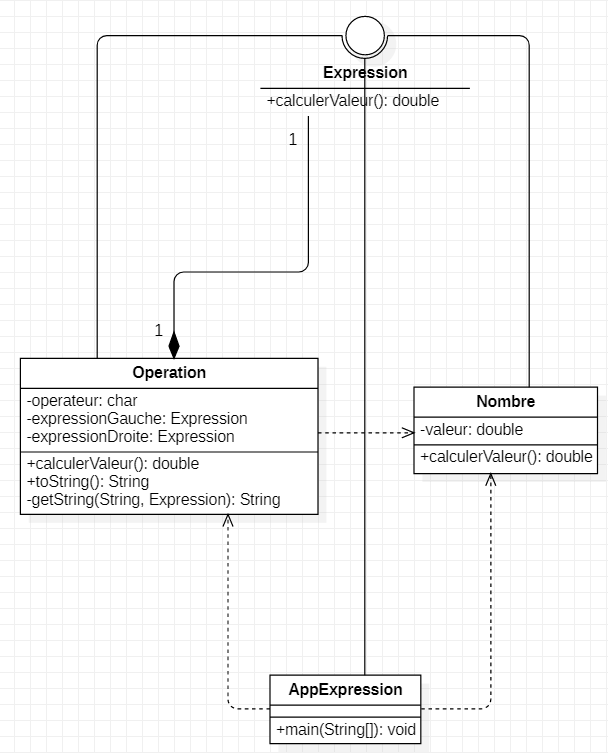
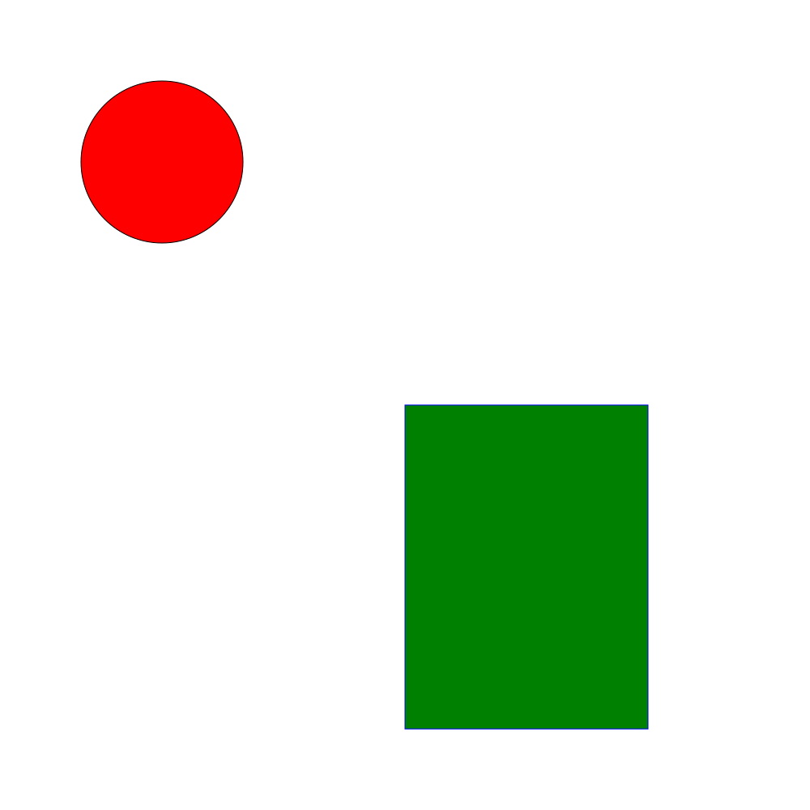
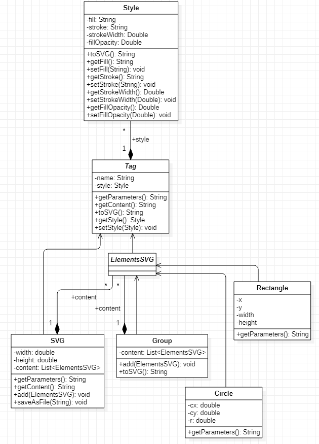
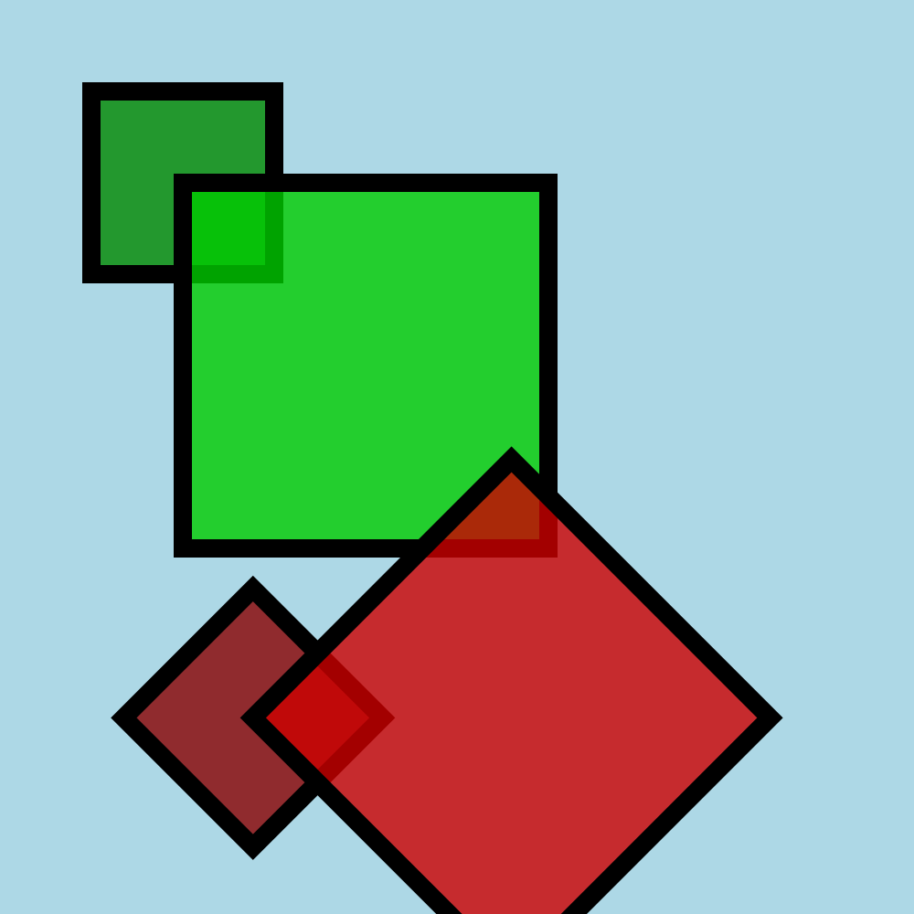
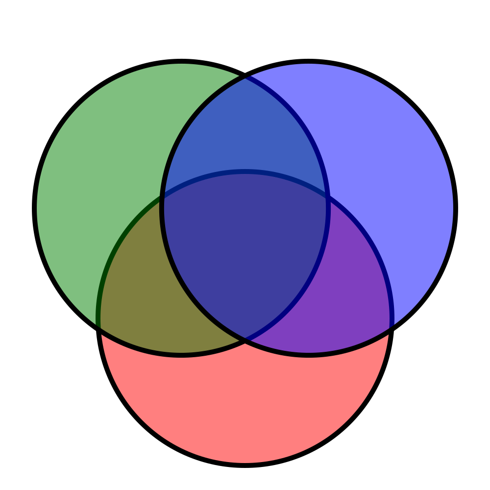
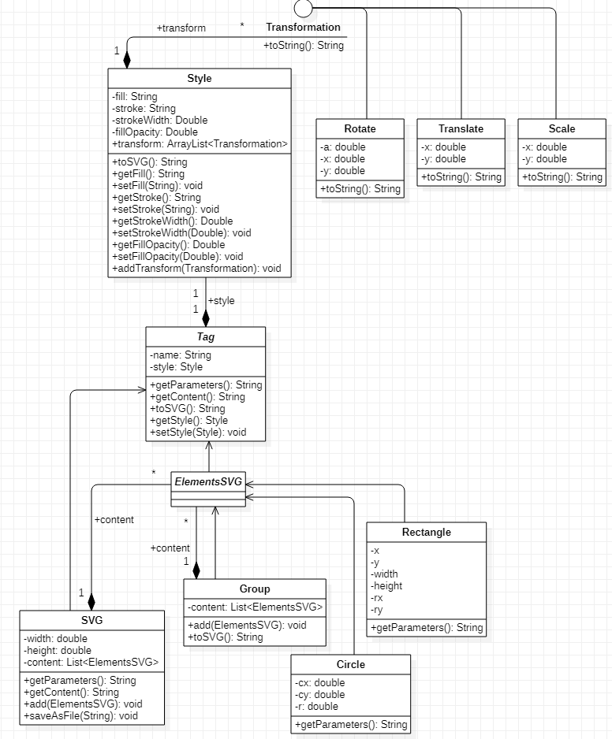
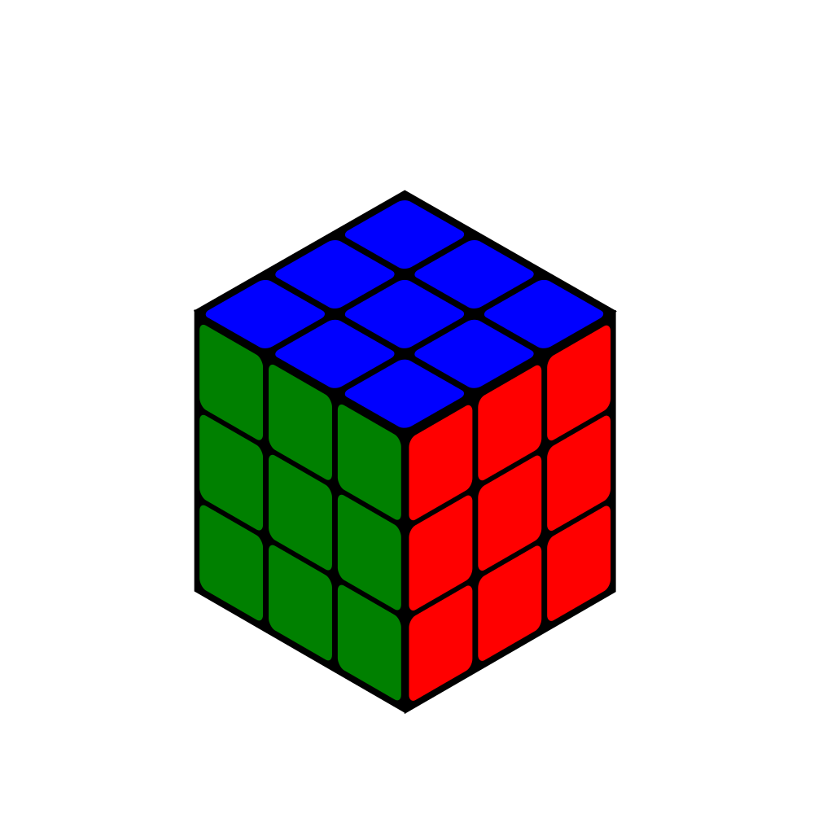

 #### Exercice 1
 ##### Question 3
 
La fleche d'agregation 1 vers 1 permet de montrer que l'on peut faire une recursion et aussi que operation peut pointer vers une expression qui pointe vers une operation.

 #### Exercice 1
 
 ##### Question 6
 Voici le résultat obtenue
 
 
 
 ##### Question 8
 
 Pour cette question il y a plusieurs choses à faire.
 
 Avant tout il faut créer une classe abstraite qui est extends de la classe `Tag` nous l'appelerons `ElementsSVG`.
 
 
 Cette classe permettra de faire en sorte que les classes `Circle` , `Rectangle` et `Group` soit extends de `ElementsSVG` plutot que de `Tag`.
Egalement dans la classe `Group` la list sera à présent une list de `ElementsSVG` plutot que de `Tag`.
Ces deux modifications permettronts qu'il ne soit pas possible d'ajouter un element `SVG` dans un `Group`.

Enfin il suffit de modifier la list de `SVG` qui était à la base une liste de `Tag` en `ElementsSVG` afin qu'il ne soit pas possible d'ajouter dans un element `SVG` dans un autre element `SVG`.

##### Question 9

On a `Group` et `SVG` qui se ressemble beaucoups (`add()` trés semblables).

On pense à l'héritage multiple mais pour commencer il n'est pas possible en Java mais surtout il n'a pas de sens dans notre code ce n'est pas normal qu'un `Group` puisse hériter d'un `SVG` ou inverssement.

Solution : On instancie un objet `SVG` dans la methode `getContent()` de la classe `Group` afin de pouvoir utiliser la méthode `getContent()` de la classe `SVG`.

##### Question 13

Voici le résultat obtenue

##### Question 14

Voici le résultat obtenue

J'ai eu quelques souci avec cette question je ne comprenais pas comment trouver le "centre" de la figure.

Mais aprés vous avoir posé la questions ça a été beaucoup plus simple.

C'est juste un cerce avec une rotation par rapport au "centre" de la figure.

##### Question 15

##### Question 16

Voici le résultat obtenue

J'ai eu énormément de problèmes avec cet exercice, je comprenais qu'il fallait faire un losange avec les cotés égaux (que je n'ai pas réusssi) puis ensuite de faire une rotation comme pour le cercle de la question 14 en prenant comme centre de rotation le point d'intersection des trois losanges.

Donc à la place j'ai fait un losange avec un skew de 30 et un autre de -30 pour faire le fond de la partie verte et rouge.

Pour le coté bleu j'ai essayé de faire quelque chose de "semblables" aux deux autres cotés mais pas identique car je n'avais pas de base un losange à coté identiques au départ.

Enfin pour ce qui est des petits carrés du Rubik's il s'agit tout simplement d'une question de scale puis de translation le tout d'en une boucle.

Au final je pense que je n'ai pas réussi cette exercice même si j'y ai mis beaucoup de temps car pour la partie bleu j'ai juste "déssiné" en modifiant petit à petit le code directement dans le visualiseur SVG.